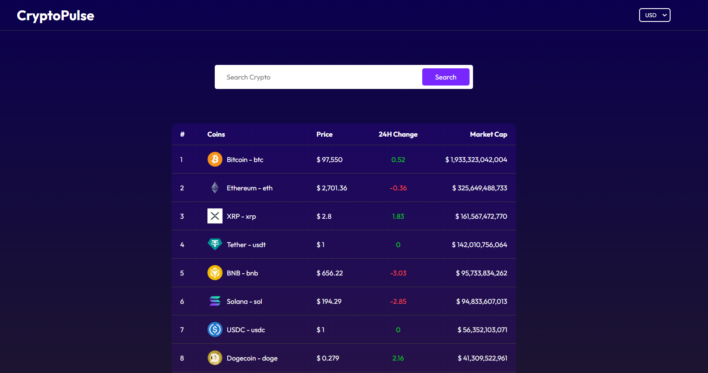
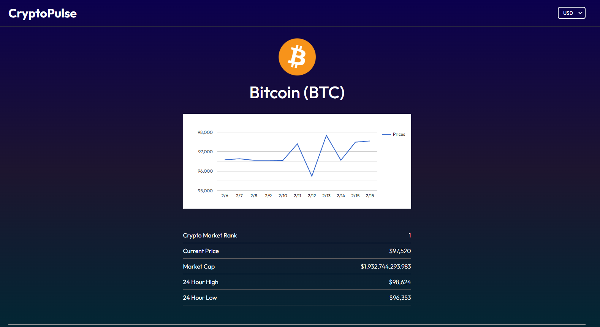

# Crypto-plus

---

[Live](https://crypto-plus-rose.vercel.app/) | [GitHub Repository](https://github.com/rushikesh5035/Crypto-plus/)

A React.js application to track real-time cryptocurrency prices, using the CoinGecko API for fetching live data.

---

## Screenshots

**Home Page**



**Details Page**



---

## Tech Stack

- **Frontend**: React.js
- **API**: CoinGecko API
- **Deployment**: Vercel

---

### Steps

1. Clone the repository:

   ```bash
   git clone https://github.com/username/project-name.git

   npm install

   npm run dev
   ```
